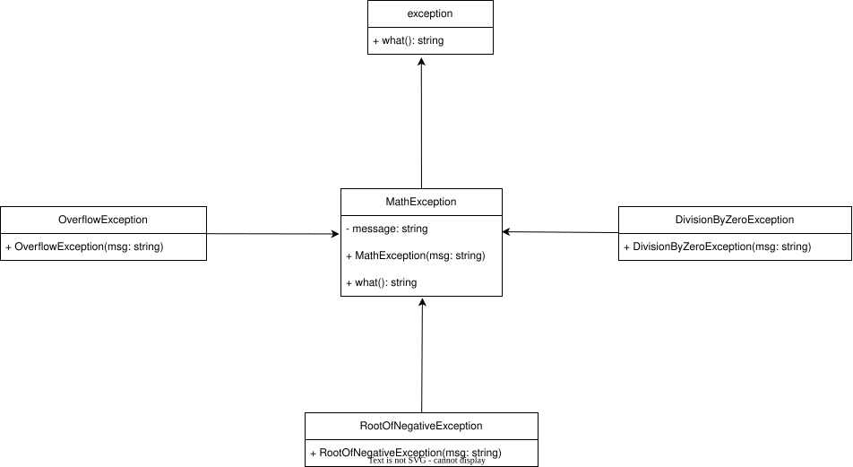

# Exception Class Hierarchy Documentation

For more details about this exercise, please refer to [Lab_12.pdf](lab_12.pdf) Exercise 1.

## Overview

This exercise implements a custom exception hierarchy for handling mathematical operations errors. The hierarchy consists of a base exception class `MathException` that inherits from `std::exception`, with several specialized child exception classes.

## Class Hierarchy Design



## Implementation Details

### Base Exception Class

`MathException` serves as the base class:

- Inherits from `std::exception`
- Contains a protected `std::string message` member
- Overrides the `what()` virtual method from `std::exception`
- Provides a constructor that takes an error message

### Specialized Exception Classes

Three specific exception types inherit from `MathException`:

#### 1. `DivideByZeroException`

- Thrown when attempting division by zero
- Default message: `"Division by zero is not allowed"`

#### 2. `OverFlowException`

- Thrown when numeric overflow occurs
- Default message: `"Number too large to process"`

#### 3. `RootOfNegativeException`

- Thrown when calculating the square root of a negative number
- Default message: `"Cannot calculate square root of negative number"`

## Usage Example

```cpp
try {
    // Example code that may throw exceptions
} catch (const MathException& e) {
    std::cerr << e.what() << std::endl;
}
```

## Key Design Decisions

- Used inheritance to establish a clear exception hierarchy
- Implemented `what()` for consistent error reporting
- Made the base class abstract to enforce specialization
- Used `const std::string&` for message passing to avoid copies

## Benefits

- Consistent error handling interface
- Type-safe exception catching
- Maintainable error message management
- Polymorphic exception handling capability
